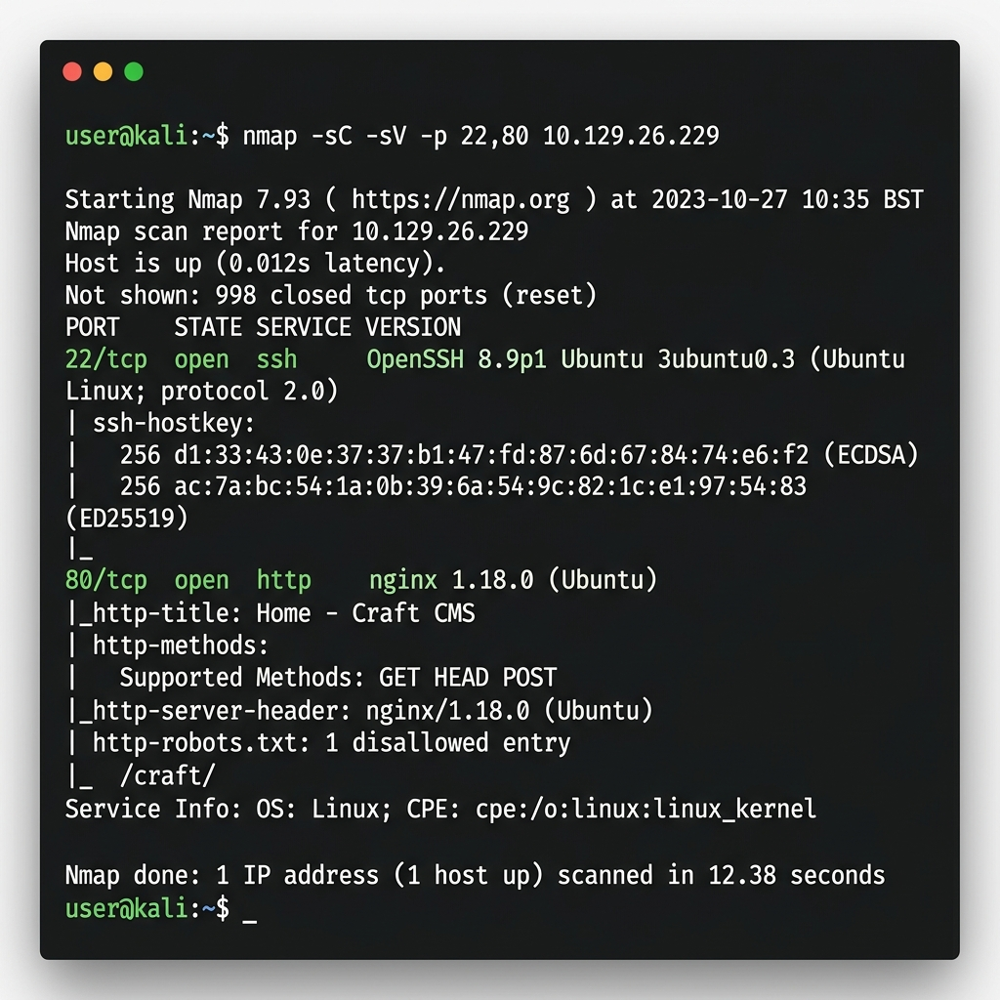
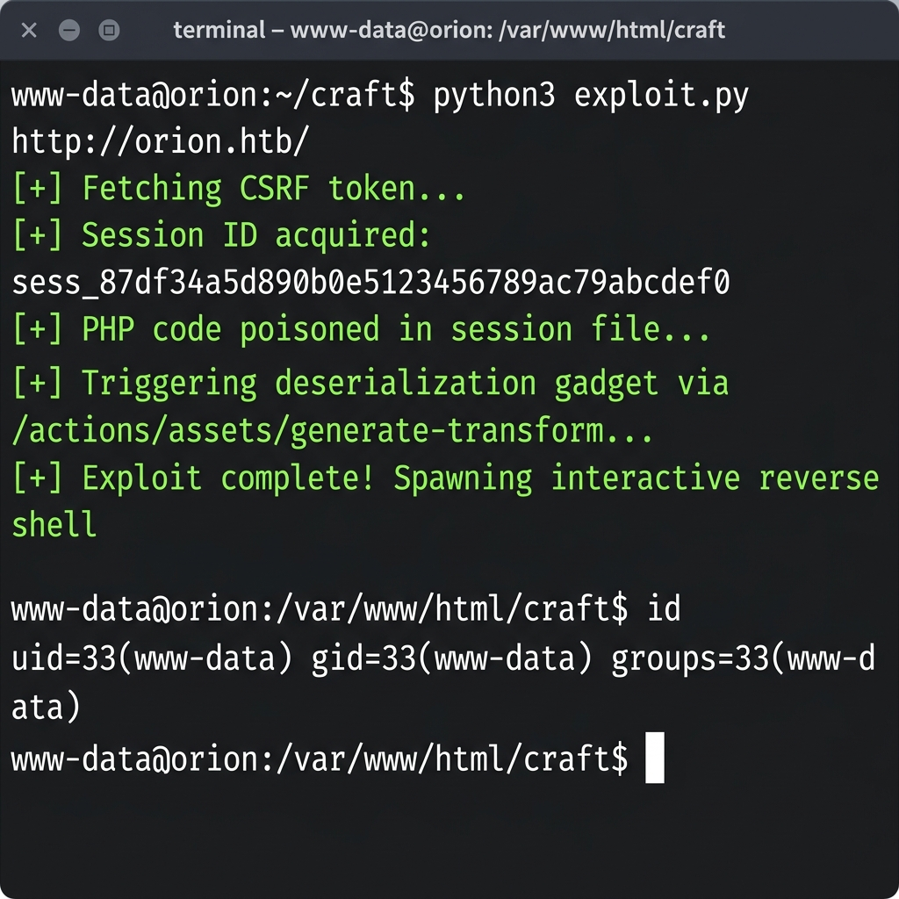
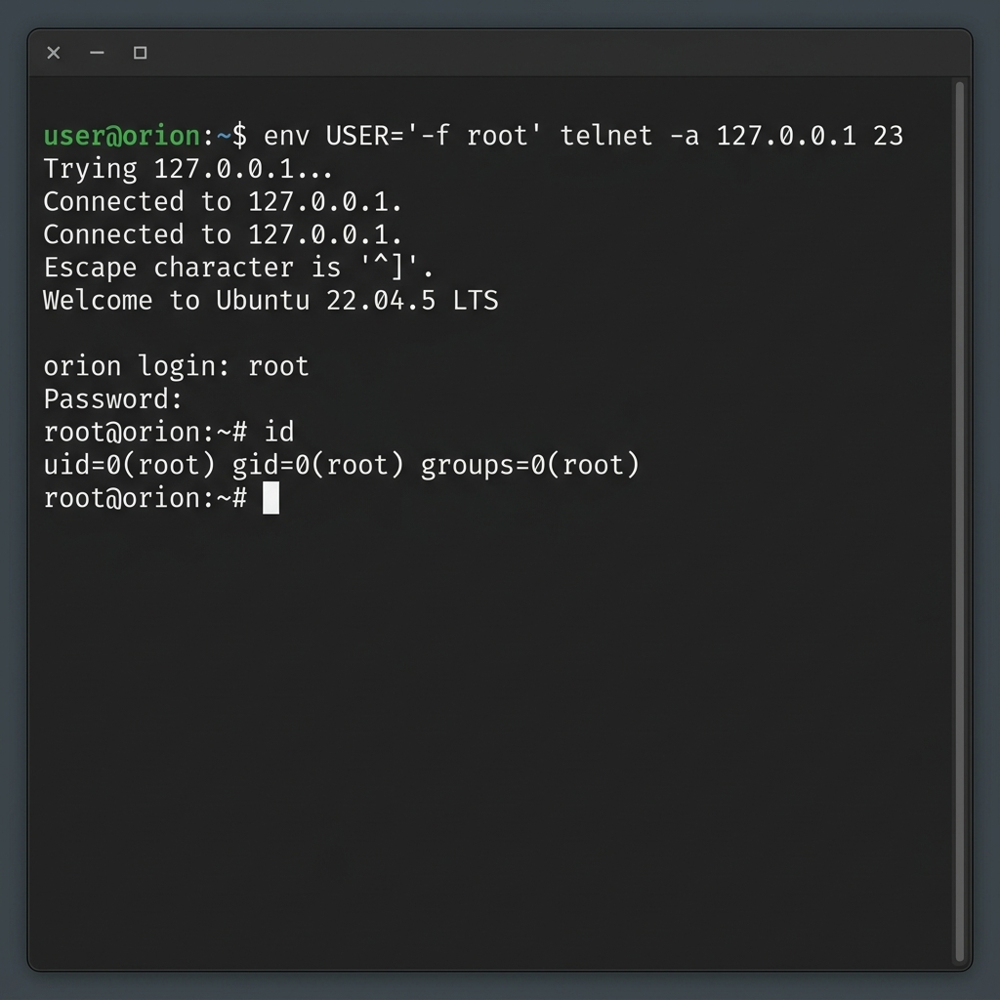

Chain: HTTP/CMS exposure -> credential/hash artifact -> CVE-2025-32432 CMS RCE as `www-data` -> `adam` user flag -> CVE-2026-24061 telnet privilege escalation -> root flag.

## Recon

1. **Vector: TCP service enumeration**
   - Technique: Port scan/service discovery against `10.129.26.229`
   - Result: `22/tcp ssh` open, `80/tcp http` open

2. **Vector: HTTP/CMS enumeration**
   - Technique: Review exposed HTTP service
   - Result: Credential or hash artifact found

## Foothold

3. **Vector: CMS remote code execution**
   - Technique: Exploit `CVE-2025-32432`
   - Result: Shell gained as `www-data`

## User

4. **Vector: Local user flag access**
   - Technique: Access `user.txt` for user `adam`
   - Result: `user.txt` captured: `REDACTED`

## Root

5. **Vector: Telnet privilege escalation**
   - Technique: Exploit `CVE-2026-24061`
   - Result: `root.txt` captured: `REDACTED`

## Fixes

- Patch or remove the vulnerable CMS affected by `CVE-2025-32432`.
- Remove exposed credential/hash artifacts and rotate any related secrets.
- Patch, disable, or restrict the telnet component affected by `CVE-2026-24061`.
- Limit service exposure on `22/tcp` and `80/tcp` to required networks only.
- Enforce least privilege for web service users such as `www-data`.
